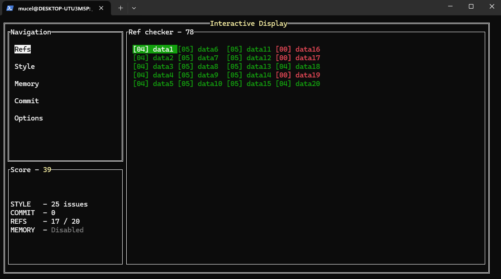
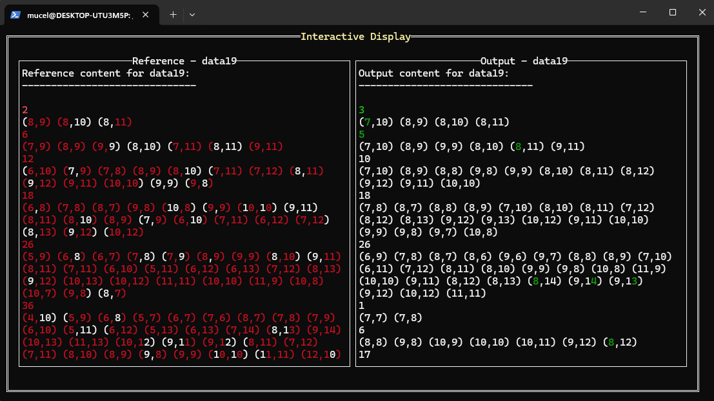
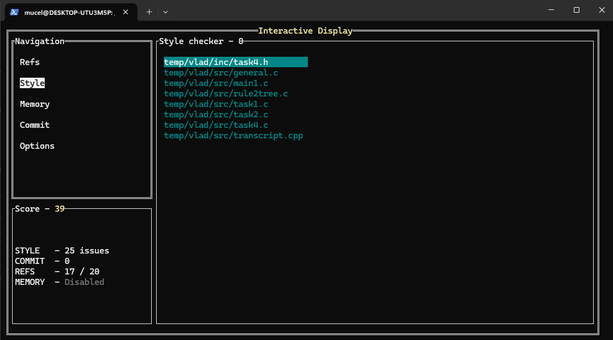
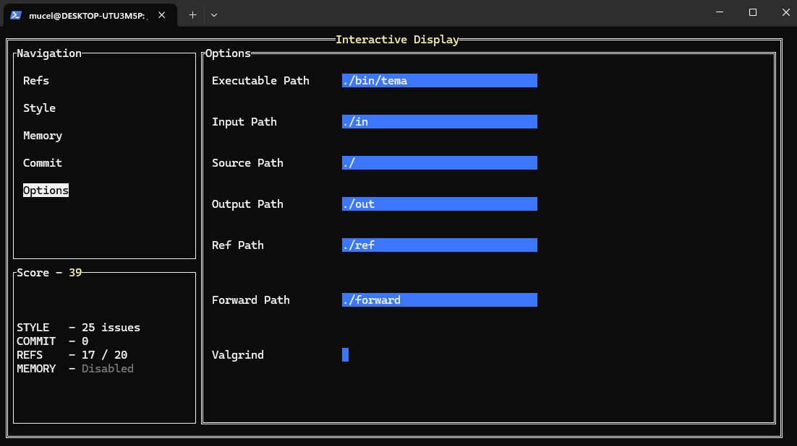

# Project overview
This project is primarily implemented in C, providing a classic and efficient way to explore the Game of Life. It includes the core logic for simulating cellular evolution, along with utilities for checking code quality and performance.

## Game of life features
The implementation likely includes:

##Grid Representation: Utilizes a 2D array to represent the game board, where each cell can be either alive or dead.

##Game Rules: Adheres to Conway's original rules for cell evolution:
Any live cell with fewer than two live neighbours dies (underpopulation).
Any live cell with two or three live neighbours lives on to the next generation.
Any live cell with more than three live neighbours dies (overpopulation).
Any dead cell with exactly three live neighbours becomes a live cell (reproduction).
Generation Updates: Logic to calculate the state of the next generation based on the current one, often using techniques like "double buffering" for smooth transitions.
Neighbor Counting: A mechanism to accurately count live neighbors for each cell, including handling edge cases, potentially with a "torus" mode where the grid wraps around.
Input/Output: Methods for defining initial cell configurations (universes) and displaying the evolving generations, possibly through the console or file output.

## Code implementation:
there are 4 task but only 3 implemented. 

Task1: take a matrix input from a file and modifies the given input as stated in the game rules

Task2: take a matrix input from a file and stores the modifies cells from the original matrix into stacks and output them into another file

Task3: 

Task4: is not implemented due to complexity

## Code structure:
mainfirst.c contains the main function in which for every task there is the implementation. Also for every input, the reading is made here.
functiiStack.c contains the functions used to implement task1 and task2
treeFunctions.c contains the functions used to implement task3
bibTask4.c contains the functions for a posible implementation of task4
the header files contains the declarations of the functions and the definied structures needed.

## Makefile

This project consists of multiple C source files and uses a Makefile to automate the compilation process.

## 📁 File Structure

- `mainfirst.c` – The main entry point of the program
- `functiiStack.c` / `functiiStack.h` – Functions for stack operations 
- `treeFunctions.c` / `treeFunctions.h` – Functions for tree operations
- `Makefile` – The build automation script

## ⚙️ How to Use the Makefile

### 1. Compile the Project

To compile the project, run the following command in your terminal:

```bash
make
```
to clean the executable file in your terminal:
```bash
make clean
```
For a posible implementation of task4 include in the make file at SRC another source file and a header

The input files are stored in the input folder. It is not necessary to run them separately the checker does it automatically when make file is run.


# PA CHECKER

## License

This project is using the `ISC` License.

## Contributors

* Asavoae Cosmin-Stefan
* Gatej Stefan-Alexandru
* Neamu Ciprian-Valentin
* Potop Horia-Ioan

## Dependencies

* `valgrind`
* `cppcheck`
* `git`

### Quick install

```bash
# Update the package repositories
sudo apt update

# Install valgrind
sudo apt install valgrind

# Install cppcheck
sudo apt install cppcheck

# Install git (if not already installed)
sudo apt install git
```

## Features

- [x] Parallel test running

- [x] Configuration
  - [x] Configurable tests
  - [x] Configurable modules
  - [x] User configuration
  - [x] Macros

- [x] Modules
  - [x] Module dependency checks
  - [x] Diff module
  - [x] Memory module _(valgrind backend)_
  - [x] Style module _(cppcheck backend)_
  - [x] Commit module _(git backend)_

- [x] Interface
  - [x] Basic - full module dump
  - [x] Interactive
    - [x] Live reload
    - [x] Module output visualization
      - [x] Side-by-side diff visualization
      - [x] Memory leak information

  
- [x] OS Compatibility
  - [x] `Linux / WSL` - full support
  - [ ] `OSX` - partial support _(no backend for the memory module)_
  - [ ] `Windows` - partial support _(no backend for the memory module)_

## Overview

### Running the checker

#### Basic
```bash
./checker
```

#### Interactive
```bash
./checker -i
```

### Navigating the interactive interface

* Use the `arrow keys` to navigate around
* Press `TAB` to switch between navigation and current section
* Press `ESC` to exit a fullscreen page
* Press `ESC` or `Ctrl+C` while on the main page to exit the program
* Press `~` to trigger a test run _(or modify the executable)_
* `Mouse` should be fully supported

### Configuration

Inside `config.json` or the `Options` tab you can modify the following:

* `Executable Path` - the executable that will be used to run the tests
* `Source Path` - the project root directory
* `Input Path` - the directory containing the input files
* `Output Path` - the directory where the test output will be stored
* `Ref Path` - the directory containing the reference files
* `Forward Path` - the directory where the `stdout` & `stderr` of each test will be stored
* `Valgrind` - whether to run the tests using valgrind or not _(disable for faster iteration)_
* `Tutorial` - display the tutorial again _(disabled afterward)_

### Interface screenshots
<div style="text-align: center;">


<br>
`Refs tab example`

</div>

<br>


<div style="text-align: center;">


<br>
`Diff visualization`

</div>

<br>

<div style="text-align: center;">


<br>
`Style tab example`

</div>

<br>

<div style="text-align: center;">


<br>
`Options tab example`

</div>


---

<br>

### FAQ

1. What does the live reload feature do?
> The live reload feature watches for any changes made to the provided executable and triggers a new test run when it's modified.

<br>

2. One or more modules went into panic! What do I do now?
> One or more modules might go into panic from various reasons. The common ones are:
> * The executable was deleted or an invalid path was provided
> * The checker doesn't have read / write access to one or more of the provided paths
> * The config was set up incorrectly
> 
> Simply look for any of these issues. After you're sure that the problem is fixed, just relaunch the checker or trigger a new run by recompiling your code. _(or by pressing `~`)_

<br>

3. I solved the whole assignment but my score is not 100! Where did my points go!?
> Please check that all modules are enabled first. _(no `DISABLED` status)_

<br>

4. All the modules are enabled but my score is still not 100!
> Probably there are still issues to be ironed out, make sure that each module page displays no errors.

<br>

5. I previously had a score of 100 on a test and although I didn't modify any of the code responsible for the test, my score is now lower.
> The memory and git modules run on your entire code. If you recently added code that produces leaks, for example, this will affect the score on all tests. Make sure to correct all memory and git issues before you submit your program for a specific task.

---

<br>

## Contributing

> This project is still a work-in-progress and any contributions are welcome!

### Project Structure

* root
  * `bin` - Windows & Linux compiled binaries 
  * `res` - project resources: config files
  * `src` - project source files
    * `checker-modules`
    * `display`
    * `menu`
    * `manager`
    * `utils`
  * `main.go` - project entrypoint
  * `Makefile` - use this to compile the project

### Building the checker

To build the checker simply run
```bash
make build-linux # ELF executable

make build-windows # Win32 executable

make build-macos # OSX executable
```

### Formatting

Before committing any changes, run
```bash
make vet

make lint
```

### Commit format

* Keep in mind that Andra recommended that the commits be in english.
* The commits must be signed (`git commit -s`)
* The commit messages should have the following structure

```
MODULE: <concise title>

*detailed description* (around 75 characters per line)
```
> Example commit message
> ```
> ref: Added order checks
> 
> Lorem ipsum odor amet, consectetuer adipiscing elit. Neque magna platea
> ornare a maecenas aptent tincidunt. Tellus dolor maecenas congue pharetra
> leo himenaeos dis curabitur. Accumsan venenatis eget ipsum enim montes
> volutpat quisque. Diam finibus leo mattis fames efficitur.
> ```
